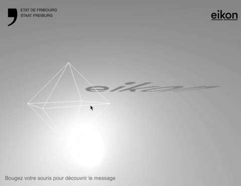

# Basic Shadow shape demo
A basic demo to demonstrate the principle to reveal invisible text ans shapes through a light.  It is done with [three.js](https://threejs.org/).

## Demo
Live demo [here](https://www.carolinebuttet.ch/eikonlab/)

## Install
No instalation

## Running
Run it with a local server (not provided)